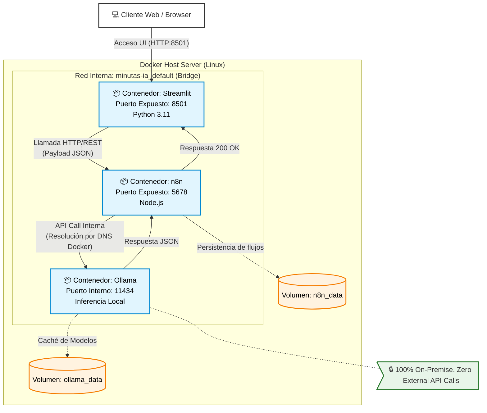

# Presentación de Arquitectura: Minutas-IA

## 1. Diagrama de Infraestructura y Red (Mermaid)

Este diagrama detalla cómo se comunican los contenedores de forma aislada y segura en el servidor, sin depender de redes externas.

## 2. Argumentos Técnicos para Infraestructura / Seguridad

**1. Privacidad de Datos Total (Zero-Trust Compliant):**
El pipeline completo de IA se ejecuta de forma *On-Premise* dentro de la red local. A diferencia de soluciones comerciales como ChatGPT o Claude, **ningún documento sensible, grabación o minuta abandona los servidores de la empresa**. 

**2. Arquitectura Contenerizada Aislada:**
La solución está empaquetada mediante `docker-compose.yml` utilizando una red de tipo *Bridge* aislada. Ollama no expone sus puertos al exterior; Streamlit y n8n se comunican con él estrictamente mediante la resolución DNS interna de Docker (`http://ollama:11434`), minimizando drásticamente la superficie de ataque.

**3. Prevención de OOM (Out Of Memory) y Estabilidad:**
Se ha diseñado un middleware en **n8n** con un patrón avanzado de *Split-in-Batches* (Chunking). Esto previene que audios o reuniones extremadamente largas colapsen la memoria RAM del contenedor del orquestador, dividiendo la carga de procesamiento del LLM en paquetes manejables en lugar de saturar el contexto del modelo.

**4. Resiliencia de Interfaz (Graceful Fallback):**
El sistema se rige bajo un contrato de datos estricto (JSON). Si por algún motivo de alta concurrencia el motor de IA falla en generar el renderizado Markdown estandarizado, la aplicación central en Python intercepta el JSON crudo y renderiza visualmente la estructura a prueba de fallos. Esto garantiza que el usuario final nunca experimente pantallas de error o fallos catastróficos en la UI.
