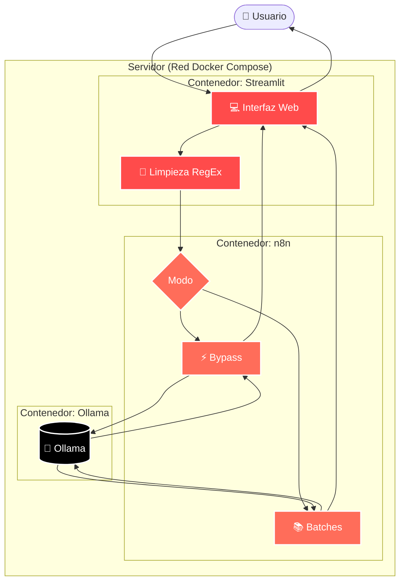

# ⚡ Minutas-IA (Legacy / Versión Estable)

<div align="center">
  <p><strong>Guía de Arquitectura y Mantenimiento para Desarrolladores</strong></p>
</div>

---

Bienvenido al repositorio de **Minutas-IA**. Este documento está diseñado como una guía técnica para que cualquier desarrollador o ingeniero del equipo pueda comprender, mantener y extender este proyecto rápidamente. 

El objetivo de este sistema es generar minutas de reuniones de forma local (On-Premise) garantizando la privacidad de los datos, usando una arquitectura basada en contenedores.

## 🏗️ Arquitectura del Sistema


El proyecto funciona con tres componentes clave que se comunican internamente en Docker:

1. **Frontend (`Streamlit` / Python)**
   - **Archivo clave:** `frontend_ui/app.py`
   - **Responsabilidad:** Interfaz de usuario. Limpia las transcripciones con Expresiones Regulares (RegEx) para quitar "ruido" (marcas de tiempo, repeticiones) antes de enviarlo a la IA.
   - **Magia interna:** Contiene un *fallback robusto*. Si la IA falla en formatear el Markdown, el script en Python desarma el JSON bruto y lo renderiza de manera segura para que la pantalla nunca quede en blanco.

2. **Orquestador (`n8n` / Node.js)**
   - **Responsabilidad:** Gestiona el flujo lógico y los Webhooks (`/webhook/minutas-bypass` y `/webhook/minutas-chunking`).
   - **Chunking (Anti-OOM):** Implementa un bucle *Split-in-Batches* para documentos inmensos, evitando que el contenedor colapse por falta de memoria (Out Of Memory).

3. **Inferencia Local (`Ollama`)**
   - **Responsabilidad:** Ejecutar el LLM localmente (sin salidas a internet). 
   - La red interna de Docker resuelve la comunicación apuntando a `http://ollama:11434`.

## ⚙️ Requisitos Previos (Prerequisites)

Para desplegar este entorno en el servidor, solo necesitas:
- **Docker Engine y Docker Compose** (Administrado idealmente vía Portainer).
- **Ollama** (Corriendo en el host del servidor o contenedorizado, con el modelo base descargado: `ollama run qwen2.5:3b` o `llama3.2:3b`).

## 🚀 Cómo Iniciar / Desplegar

El proyecto está contenerizado. Si necesitas levantarlo de cero o reiniciar el entorno:

```bash
# Clonar y entrar al directorio
git clone https://github.com/mbaigorriaia-design/minutas-ia.git
cd minutas-ia

# Construir y levantar todo en background
docker compose up -d --build
```
> **Tip de Mantenimiento:** Para actualizar el servidor tras hacer cambios en el código (`app.py`), entra a Portainer, selecciona el stack de `minutas-ia` y haz clic en **"Pull and redeploy"**.

## 🛠️ Guía Rápida para Desarrolladores (Dónde tocar)

- **Para cambiar el comportamiento del Prompt de la IA:** 
  Edita la variable `prompt_sistema` dentro de `frontend_ui/app.py` (líneas ~275 y ~360).
- **Para mejorar la limpieza del texto previo:** 
  Modifica la función `extract_text()` en `frontend_ui/app.py`. Ahí se centralizan todos los RegEx.
- **Para modificar el enrutamiento o puertos:** 
  Revisa `docker-compose.yml`. Recuerda no usar `localhost` para comunicación entre contenedores, usar siempre los nombres del servicio (ej: `http://n8n:5678`).

## ⚠️ Resolución de Problemas Comunes (Troubleshooting)

1. **La ejecución da "Timeout" o tarda más de 40 minutos:**
   - Ocurre con audios de más de 2 horas. En `app.py`, la variable `tiempo_espera` en las llamadas HTTP está seteada a 7200 segundos (2 hrs) para soportarlo, pero asegúrate de que el flujo de *n8n* esté utilizando el modo "Extenso" (Chunking) para evitar colgar al modelo.
2. **Error de Conexión SSRF / ECONNREFUSED en n8n:**
   - Significa que n8n no encuentra a Ollama. Asegúrate de que las variables de entorno de n8n apunten a `ollama` y no a `localhost` o `host.docker.internal`.
3. **El JSON de respuesta se imprime con etiquetas raras (Texto:, Fecha:):**
   - El formateador de listas en `app.py` está diseñado para atrapar y omitir estas etiquetas dinámicamente. Si aparece una nueva etiqueta recurrente, agrégala a la lista de omisiones dentro de la lógica del *Fallback* en `app.py`.
